# Managing Secrets in Release with Doppler

Example application showing how you can access your Doppler secrets in an environment being run on the Release platform.
## About Release

Release makes it easy to create cloud native full-stack environments with data, on demand. These environments can be used
for feature previews, quality assurance purposes, sales demonstrations, or running production environments.

## Setup

### Github

Fork this repository.

### Doppler

[Log into Doppler](https://dashboard.doppler.com/) and select a project.

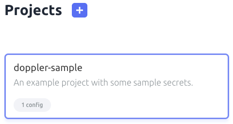

Select an environment to pull secrets from.

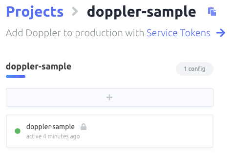

For testing purposes, insert a new variable into the selected environment as `TEST_VARIABLE`. Set the value to 
your first name.

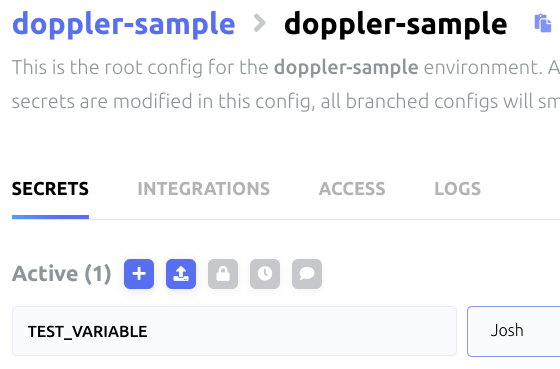

Now, [generate a service token](https://docs.doppler.com/docs/service-tokens) from that environment. Copy the 
generated token somewhere, it'll be needed later.

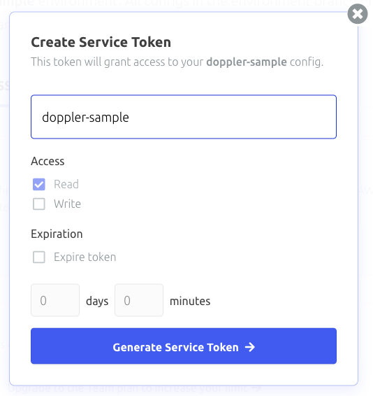

### Release

[Sign into Release](https://app.releasehub.com/auth/login-page).

[Create a new application](https://docs.releasehub.com/getting-started/create-an-application) based on your fork of 
this repository.

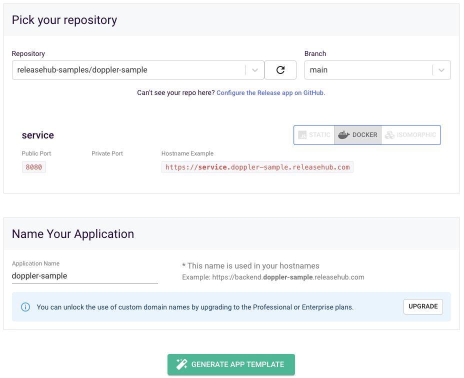

Click the button at the bottom of the page to generate your application template.

For the Application Template, we will use the autogenerated template. Hit Save & Continue at the bottom.

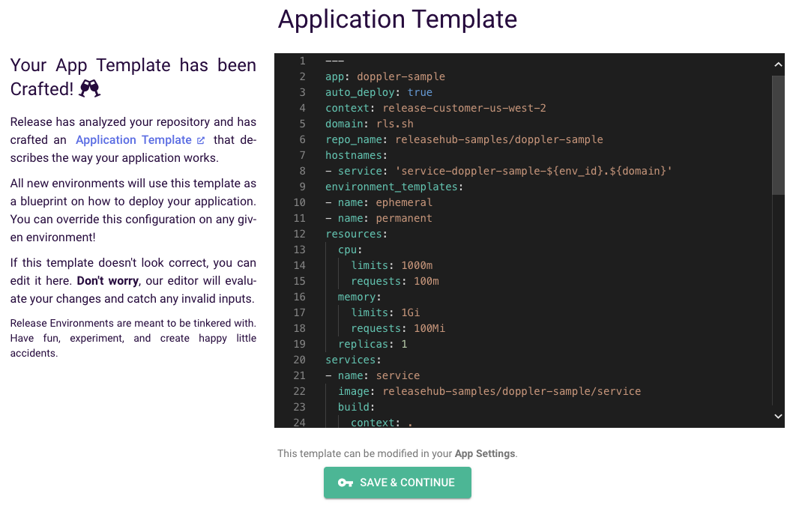

On the next screen, we'll go ahead and Start Build & Deploy.

Now we need to add a build argument. A build argument can specified at the account level, making it available to every 
application, or at the application level, making it solely for that application's build. For this demonstration, [make it 
application level](https://docs.releasehub.com/reference-guide/application-settings/app-level-build-arguments).

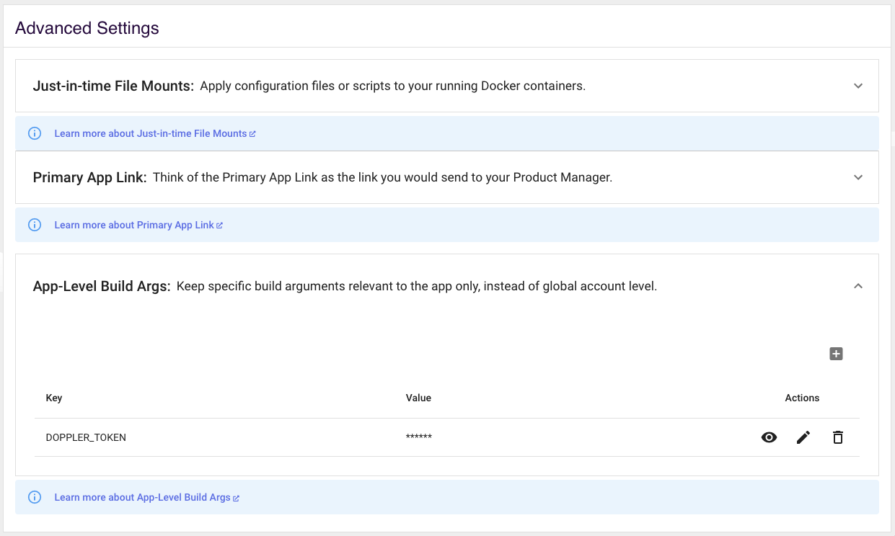

Click on builds from the top navigation bar and start a new build from the main branch.

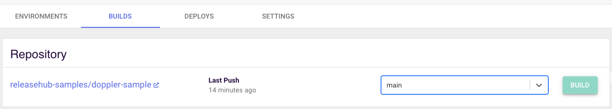

When the build finishes, navigate to the environments tab. Click on Create New Environment in the top right of the 
screen. Select the main branch and make the environment type ephemeral. Hit the button to start creating your 
environment.

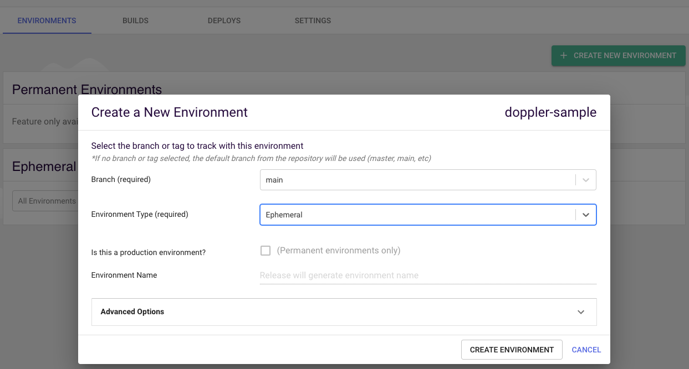

When the environment is done being created, navigate to the newly created environment.

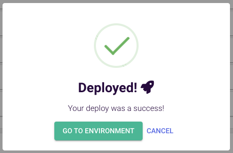

On the right side, you'll find the Hostname URLs. Click on the link next to "service".

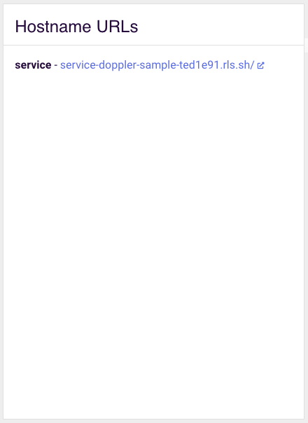

Observe your name being printed to the screen in a friendly greeting. You've successfully pulled environment variables 
from Doppler into your Release application.
